# Oracle-SQL

## What is Oracle ?

- Oracle is a powerfull relational database software developed by "Larry Ellison and his friend" bob miner & ED oats in the year of 1977 at software development lab(SDL).

## History

- 1878 RSI developed oracle v2 just support SQL.
- 1982 change name "Oracle Corporation"
- 1983 Oracle V3 develope in C.
- 1984 V4
- 1985 V5
- 1988 V6 (PL/SQL).
- 1990 V8
- 1999 Oracle 8i
- 2001 Oracle 9i
- 2003 Oracle 10g
- 2007 Oracle 11g
- 2013 Oracle 12c
- 2018 Oracle 18c
- 2019 Oracle 19c (latest)

## What is Database ?

- Organizad collection of data in a particular format, so that it can be easily accessed and managed.

- *Advantages*
  - Data retrieval
  - Security
  - Data redundency
  - Data integrity
  - Indexing

## Open Run SQL Command Line

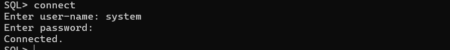

## Create a Table

```bash
create table Emp(
    Eid number,
    Ename varchar2(20),
    Eadd varchar2(30)
)
```

## Show the table description


## Insert Single Data into the Table

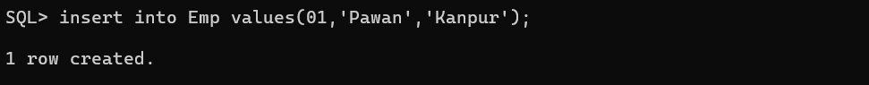

## Show the table data

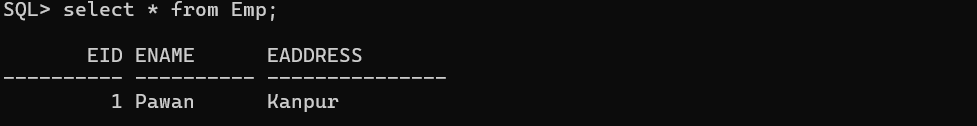

## Delete Table

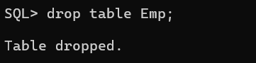

## Object of Oracle

1. Table : It is used to store information.
2. View : Logically represent subset of data from one or more table.
3. Sequence : Used to generate primary key values.
4. Index : It is used to improve performance of query.
5. Synongm : Used to give alternate name to object.

## what is Datatype ?

- Datatype define type of information and the amount of spaces required for a particular column.

### Datatypes

    |
    |-> String
    |    |-> char(size)
    |    |-> varchar(size)
    |    |-> nchar(size)
    |    |-> nvarchar(size)
    |
    |-> Number
    |    |-> number(p,s)
    |
    |-> Date  (DD || MM || YYYY) || (HH || MM || SS)
    |    |-> Date + Time 
    |    |-> Date + TimeStamp
    |
    |-> Large Object
    |    |-> CLOB (Character)
    |    |-> BLOB (Binary)
    |    |-> BFile (Point File Location)

## Rule for create a Table

1. The name of table must be unique in oracle Database.
2. The Maximum length of table is 30 character long.
3. A table contain maximum 1000 column and unlimited records.
4. The attribute name of table must be unique.
5. The name of table can be define by the help of alphabet it could be in `uppercase or lowercase,digits and 3-special symbles(_,#,$)`.

## What is SQL ?

- SQL (Structured Query Language).
- Every relational database softwuare intract with a language known as SQL,because it's a simple english as language which guidelines are provided by a  standard Organization `ANSI` adopted by all `Orcale,mySQL,Microsoft` etc..
- An SQL is very complex language to reduce its complexity, it can sub-catogized into `5 sub-language`.

  - DDL `(Data Definition Language)`
    - Create,Drop,Truncate,Alter and Rename
  - DML `(Data Manipulation Language)`
    - Insert,Update,Delete
  - DQL `(Data Query Language)`
    - Select
  - DCL`(Data Control Language)`
    - Grant,Revoke
  - TCL `(Transaction Control Language)`
    - Commit,Rollback,Save Point

## DDL (Data Definition Language)

- The Sub-Language deals with objects of database like table,views,sequence etc..

    1. Create

        ```bash
            create table table-name(<field1><datatype>,<field2><datatype>, .... <fieldN><datatype>);
        ```

        example:
            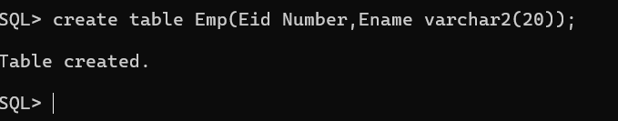

    2. Drop
        - Delete the table-Structure and table  data also.

        Example :
        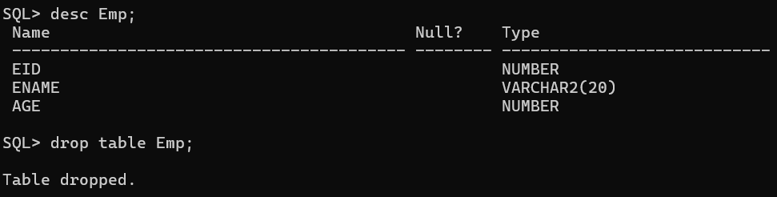

    3. Truncate
        - Truncate will only delete the table data not table - Structure.

        ```bash
            truncate table table-name;
        ```

        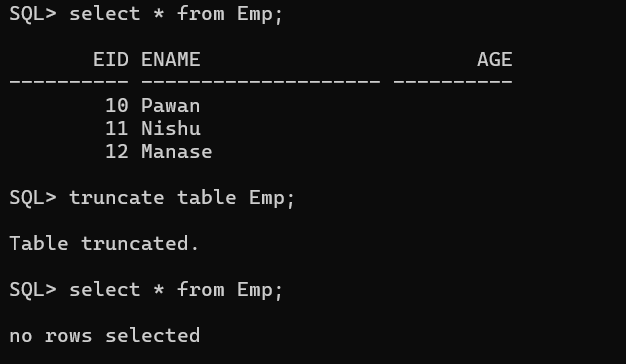
        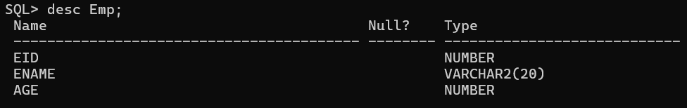

    4. Alter

        ```bash
        alter table table-name ADD column-name datatype;
        ```

        Example :
            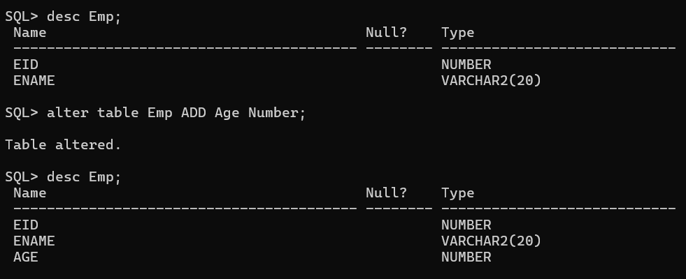
    5. Rename

        ```bash
            Rename old-table-name to new-table-name
        ```

        Example :
            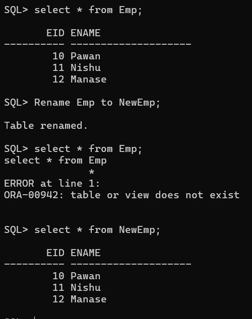

## What is the Difference between Truncate and Drop ?

- Truncate
  - Truncate command is used to remove only table records.

- Drop
  - Drop command is used ti remove both table and table records permanently.

## DML (Data Manipulation Language)

- It deals with data of Object. It provides 3 commands.

1. Insert

    ```bash
    insert into table-name values(value1,value2,...,valueN);
    ```

2. Update

    ```bash
    update <table> set <field> = <update> where <field> = <Reference Data>;
    ```

    Example
        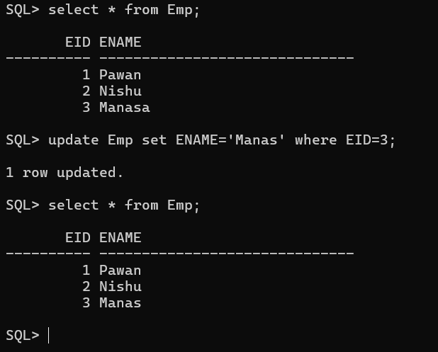

3. Delete

- Delete All records

    ```bash
      delete from table-name
    ```

  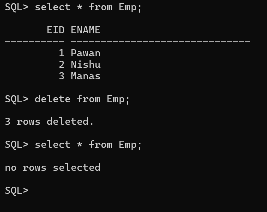

- Delete Special record

    ```bash
    delete from table-name where <field> = <reference>
    ```

    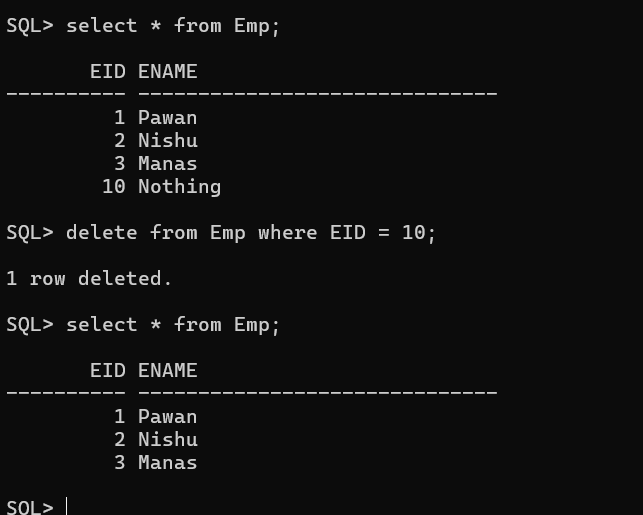

## DQL (Data Query Language)

- It is used to retrieve information from the database
- It has only one `select` command.

  ```bash
    select * from table-name;
  ```

## TCL (Transaction Control Language)

- It controls the transaction of the database,it has three commands.

1. Commit

  ```bash
    commit;
  ```

2. Rollback

  ```bash
    rollback;
  ```

3. Savepoint

## Where Clause

- where clause restricted the records means those records are unmatched in where clause condition,eliminated from the table.

- Use of where clause:
  - Select
  - Delete
  - Update

## Operators

- Operator are some character or keyword which is  use on an expression solve any operator.

The Operator of SQL can be Categorized into 3 types:

1. Unary operator
  (+,-,++,--,!)
2. Binary operator
    - Arithmetic operator
      - Concatination Operator
      - Relational Operator
      - Logical Operator
      - Another Relational Operator (V.V.I)
          - Distinct
            - It allow to retrieve unique records from the table

              ```bash
              select distinct * from table-name
              ```

          - All
            - It retieve all the information about the table including duplicate records also.

              ```bash
              select all * from table-name
              ```

          - In
            - It used to retrieve more than one record of the table.

              ```bash
              select * from Emp where Eid in(10,50,70);
              ```

          - Not In
            - It is used to retrieve unselected records from the table.

              ```bash
              select * from Emp where Eid not in(10,50,70);
              ```

          - between
            - It is used to retrieve records of table between 2 ranges.

              ```bash
              select * from Emp where Eid between 10 and 50;
              ```

          - Like
            - Like Operater is used to retrive pattern wise information from a table. It contain two wild card character
                - `% (module)`
                  - Zero or more character

                    ```bash
                      select * from Emp where Ename like 'r%';
                    ```

                - `_ (underscore)`
                  - Only for single character

                  ```bash
                    select * from Emp where Ename like '_n%';
                  ```

          - Not Like
            - Display unselected records

              ```bash
                select * from Emp where Ename not like 'r%'; 
                select * from Emp where Ename not like '_n%'; 
              ```

3. Set operator
    - Union operator
    - Union all
    - minus
    - intersect

## Set Operations

- Set operator allows us to perform algebric operations among two or more table or relation and produces a result depending on the operator.

- This operator contains for different operations they are :
  1. Union

      ```bash
        select * from table1 union select * from table2;
      ```

      `** Show only distinct records`

  2. Union All

      ```bash
        select * from table1 union all select * from table2; 
      ```

      `** Show all records including duplicates also.`

  3. Intersect `(A U B)`

      ```bash
        select * from table1 intersect select * from table2
      ```

      `** Show all unique records in both the table.`

  4. Minus
      - `(A - B) shows only A`

      ```bash
        select * from table1 minus select * from table2
      ```

## Alias

- SQL alias is used to give a temporary name of table or column.
- We can use Alias
  - Column Alias

    ```bash
      select columnName as aliasName from tableName;
    ```

  - Table Alias

    ```bash
      select columnName from tableName as aliasName;
      select Ename,Saddress from Emp E,Student S where E.Eid = S.Sid;
    ```

## Contraint (*Important*)

- Contraint are the "business logic/rule" which allow us to maintain proper data inside the table.

- In Oracle the Integrity constraint classified into 3-groups
  - Domain Integrity Containts  
    - The domain Integrity constraint allow us to insert permissionable values on a column.
  
      - Default
        - It we impose a default constraint along with a column than that column restrict to insert the "implicit NULL" values and behalf of NULL value it substitute default value.

            -- Note : This contraint is only apply on single column.

          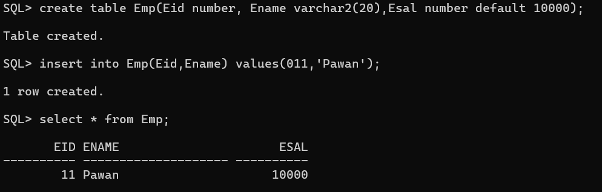

      - Not Null

      - Check
        - Check Constraint allow us to insert selected values in a column. The check constraint only applies on single column. It can be impose table level and column level.

  - Entity Integrity Containt
    - Unique Key
    - Primary Key
  
  - Referential Integrity Containt
    - Foreign Key

    ```Note :-
      1. We Can impose integrity Containt inside the table during the time of table creation and by the help of ALTER command
      
      2.During the time of table creation we can apply constraint by two different ways:
         2.1 Column Level (In-line Constraint)
         2.2 Table Level (Out-of-line Constraint)
      ```

## what is Entity Integrity Containt ?

- Entity Integrity Containt allows us to insert unique values on a column.
- Types
  - 1.1 Unique Contraint
    - Unique constraint restrict to insert duplicate values on a column but it allows NULL values.
    - It can be define in one column or multiple columns.(composite key).

  - 1.2 Primary Key Contraint
    - Primary Key Contraint restrict to insert duplicate values on a column as well as NULL values.
    - Unlike unique contraint each table contain only one primary key column.
