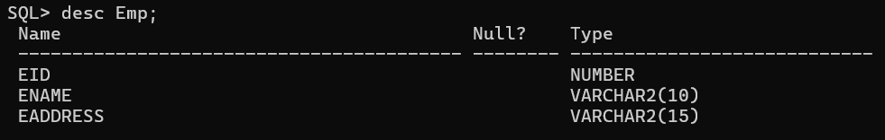

# Oracle-SQL

## What is Oracle ?

- Oracle is a powerfull relational database software developed by "Larry Ellison and his friend" bob miner & ED oats in the year of 1977 at software development lab(SDL).

## History

- 1878 RSI developed oracle v2 just support SQL.
- 1982 change name "Oracle Corporation"
- 1983 Oracle V3 develope in C.
- 1984 V4
- 1985 V5
- 1988 V6 (PL/SQL).
- 1990 V8
- 1999 Oracle 8i
- 2001 Oracle 9i
- 2003 Oracle 10g
- 2007 Oracle 11g
- 2013 Oracle 12c
- 2018 Oracle 18c
- 2019 Oracle 19c (latest)

## What is Database ?

- Organizad collection of data in a particular format, so that it can be easily accessed and managed.

- *Advantages*
  - Data retrieval
  - Security
  - Data redundency
  - Data integrity
  - Indexing

## Open Run SQL Command Line


## Create a Table

```bash
create table Emp(
    Eid number,
    Ename varchar2(20),
    Eadd varchar2(30)
)
```

## Show the table description



## Insert Single Data into the Table


## Show the table data


## Delete Table


## Object of Oracle

1. Table : It is used to store information.
2. View : Logically represent subset of data from one or more table.
3. Sequence : Used to generate primary key values.
4. Index : It is used to improve performance of query.
5. Synongm : Used to give alternate name to object.

## what is Datatype ?

- Datatype define type of information and the amount of spaces required for a particular column.

### Datatypes

    |
    |-> String
    |    |-> char(size)
    |    |-> varchar(size)
    |    |-> nchar(size)
    |    |-> nvarchar(size)
    |
    |-> Number
    |    |-> number(p,s)
    |
    |-> Date  (DD || MM || YYYY) || (HH || MM || SS)
    |    |-> Date + Time 
    |    |-> Date + TimeStamp
    |
    |-> Large Object
    |    |-> CLOB (Character)
    |    |-> BLOB (Binary)
    |    |-> BFile (Point File Location)

## Rule for create a Table

1. The name of table must be unique in oracle Database.
2. The Maximum length of table is 30 character long.
3. A table contain maximum 1000 column and unlimited records.
4. The attribute name of table must be unique.
5. The name of table can be define by the help of alphabet it could be in `uppercase or lowercase,digits and 3-special symbles(_,#,$)`.

## What is SQL ?

- SQL (Structured Query Language).
- Every relational database softwuare intract with a language known as SQL,because it's a simple english as language which guidelines are provided by a  standard Organization `ANSI` adopted by all `Orcale,mySQL,Microsoft` etc..
- An SQL is very complex language to reduce its complexity, it can sub-catogized into `5 sub-language`.

  - DDL `(Data Definition Language)`
    - Create,Drop,Truncate,Alter and Rename
  - DML `(Data Manipulation Language)`
    - Insert,Update,Delete
  - DQL `(Data Query Language)`
    - Select
  - DCL`(Data Control Language)`
    - Grant,Revoke
  - TCL `(Transaction Control Language)`
    - Commit,Rollback,Save Point

## DDL (Data Definition Language)

- The Sub-Language deals with objects of database like table,views,sequence etc..

    1. Create

        ```bash
            create table table-name(<field1><datatype>,<field2><datatype>, .... <fieldN><datatype>);
        ```

        example:
            

    2. Drop
        - Delete the table-Structure and table  data also.

        Example :
        

    3. Truncate
        - Truncate will only delete the table data not table - Structure.

        ```bash
            truncate table table-name;
        ```

        
        

    4. Alter

        ```bash
        alter table table-name ADD column-name datatype;
        ```

        Example :
            
    5. Rename

        ```bash
            Rename old-table-name to new-table-name
        ```

        Example :
            

## What is the Difference between Truncate and Drop ?

- Truncate
  - Truncate command is used to remove only table records.

- Drop
  - Drop command is used ti remove both table and table records permanently.

## DML (Data Manipulation Language)

- It deals with data of Object. It provides 3 commands.

1. Insert

    ```bash
    insert into table-name values(value1,value2,...,valueN);
    ```

2. Update

    ```bash
    update <table> set <field> = <update> where <field> = <Reference Data>;
    ```

    Example
        

3. Delete

- Delete All records

    ```bash
      delete from table-name
    ```

  

- Delete Special record

    ```bash
    delete from table-name where <field> = <reference>
    ```

    

## DQL (Data Query Language)

- It is used to retrieve information from the database
- It has only one `select` command.

  ```bash
    select * from table-name;
  ```
